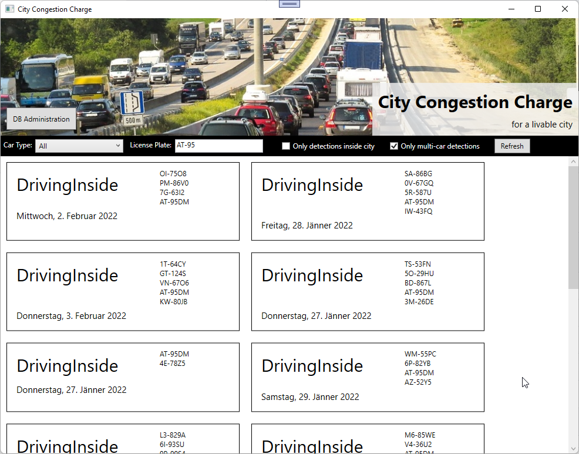
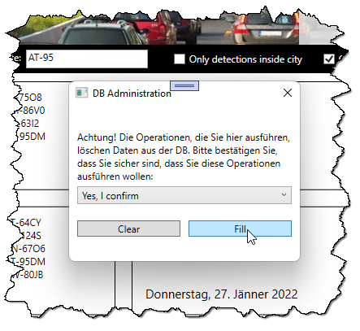

# City Congestion Charge (CCC) - WPF

## Introduction

This exercise is part of the larger [*City Congestion Charge* (CCC) sample](..). Make yourself familiar with the business requirements before starting this exercise.

In this exercise, you have to implement some query logic and a WPF UI for it.

## Starter Solution

This folder contains a starter solution that you have to extend. The CCC data model has already been implemented for you (see [*DataModel.cs*](../starter/CityCongestionCharge.Data/DataModel.cs)). Make yourself familiar with it.

The starter solution also contains a skeleton for the WPF UI ([*CityCongestionCharge.DesktopUI*](../starter/CityCongestionCharge.DesktopUI)). The skeleton already contains most of the XAML structures and styles. However, it does not contain any logic or *data bindings*. Before moving on, make yourself familiar with the WPF skeleton.

## Your Job

**Complete** the WPF UI based on the requirements in the existing WPF skeleton app. You have to work on the following functions:

* Display a list of all *detections* based on the filter options included in the WPF skeleton (car type, license plate, only detections *inside* the city, only detections with multiple cars).
  * **Note**: Try to encapsulate the query logic in a helper function inside the [*CityCongestionCharge.Data*](../starter/CityCongestionCharge.Data) project. Avoid putting the data access code directly into the WPF code.

  

* Implement the [*DbAdminWindow*](../starter/CityCongestionCharge.DesktopUI/DbAdminWindow.xaml) that is displayed when the user clicks the *DB Administration* button.
  * Call the [`DemoDataWriter.ClearAll` and `DemoDataWriter.Fill` methods](../starter/CityCongestionCharge.Data/DemoDataGenerator.cs) when the user clicks the corresponding buttons.
  * Note the requirements in [*DbAdminWindow*](../starter/CityCongestionCharge.DesktopUI/DbAdminWindow.xaml) and [*DbAdminWindowViewModel*](../starter/CityCongestionCharge.DesktopUI/DbAdminWindowViewModel.cs) regarding enabling/disabling the buttons.

  

## Tips

* If you struggle with the filtered list, implement the unfiltered list first.
